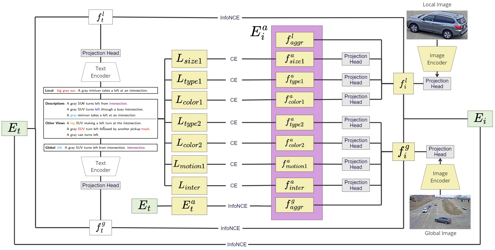

# Symmetric Network with Dual-vehicle Attributes Augmentation for Natural Language Vehicle Retrieval

This repository contains the official code for the 7th place solution of the [7th AI City Challenge](https://www.aicitychallenge.org/) Track 2.

Details about the architecture design and implementation can be found in the [paper](Symmetric_Network_with_Dual-vehicle_Attributes_Augmentation_for_Natural_Language_Vehicle_Retrieval.pdf)



## Requirements

To install requirements:

```setup
pip install -r requirements.txt
```

## Setup

Checkpoints, extracted features, and motion maps for the [2023 variation Cityflow-NL Dataset](https://github.com/fredfung007/cityflow-nl) can be downloaded [here](https://drive.google.com/drive/folders/1txIqNGAUWNP8T5a0rE4nOm7iSFmuf1Lc?usp=share_link).

- Change the paths and OSS settings in each of the configuration files of the architectures that you are going to use at `configs/[ARCH NAME]`.
- Run `python3 scripts/split_data.py` to prepare the train and validation set.
- Run `python3 scripts/extract_vdo_frms.py` to extract frames from the provided videos.
- Run `bash scripts/iou.sh` to generate IOU-filtered motion maps.
- Spatial features can be extracted by using the code from [this repository](https://github.com/ZhaoChuyang/AIC22-Track2-SMM).

## Training

Each model has a bash file that stores the training commands and hyperparameter configurations:

```train
bash run/aggr_non_linear.sh
bash run/dual_aggr.sh
bash run/feats_aug_eng.sh
bash run/feats_aug_eng_1.sh
bash run/feats_aug_text.sh
```

## Evaluation

Change the `RESTORE_FROM` setting in the model's configuration file to a checkpoint and set the `config` argument in `run/eval_only.sh` to the corresponding model before executing it:

```eval
bash run/eval_only.sh
```

## Prepare Outputs

Select the models that will be used to ensemble, merge weights, and spatial setting in `prepare_outputs.py`. Ensure that the `RESTORE_FROM` setting in each model's configuration file is properly set up.

```ensemble
python3 prepare_outputs.py
```

## In Details

### OSS Structure

.
├── logs                            # Checkpoints
│   ├── aggr_non_linear
│   └── ...
├── extracted_feats                 # Extracted features
│   ├── aggr_non_linear
│   └── ...
├── mine
│   └── data
|       ├── bk_map
|       └── motion_map_iou
├── train
│   ├── S01
│   └── ...
├── validation
│   ├── S02
│   └── ...
├── train-tracks.json
├── test-tracks.json
├── test-queries.json  
├── train.json
└── val.json


## Contributors

[](https://github.com/quangminhdinh)
[](https://github.com/yuufong)
[](https://github.com/riderhuy)
[](https://github.com/hmkhoi2701)


## Acknowledgments

This repository was implemented based on [AICITY2022_Track2_SSM](https://github.com/hbchen121/AICITY2022_Track2_SSM).

```bibtex
@InProceedings{Zhao_2022_CVPR,
    author    = {Zhao, Chuyang and Chen, Haobo and Zhang, Wenyuan and Chen, Junru and Zhang, Sipeng and Li, Yadong and Li, Boxun},
    title     = {Symmetric Network With Spatial Relationship Modeling for Natural Language-Based Vehicle Retrieval},
    booktitle = {Proceedings of the IEEE/CVF Conference on Computer Vision and Pattern Recognition (CVPR) Workshops},
    month     = {June},
    year      = {2022},
    pages     = {3226-3233}
}
```
